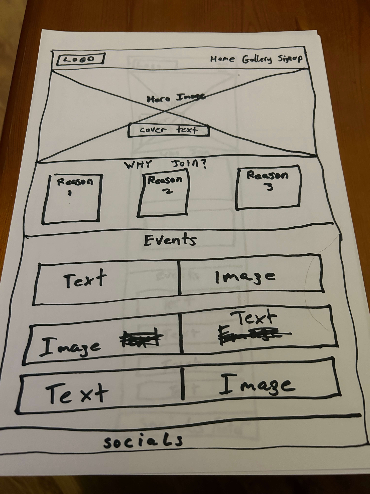
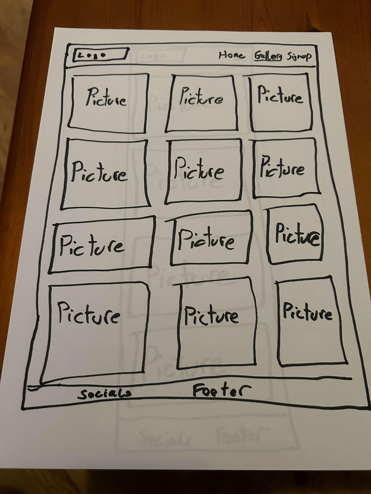
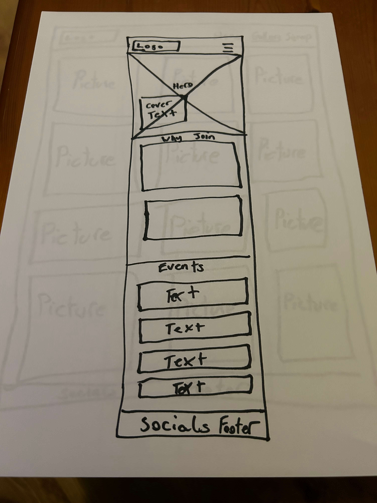
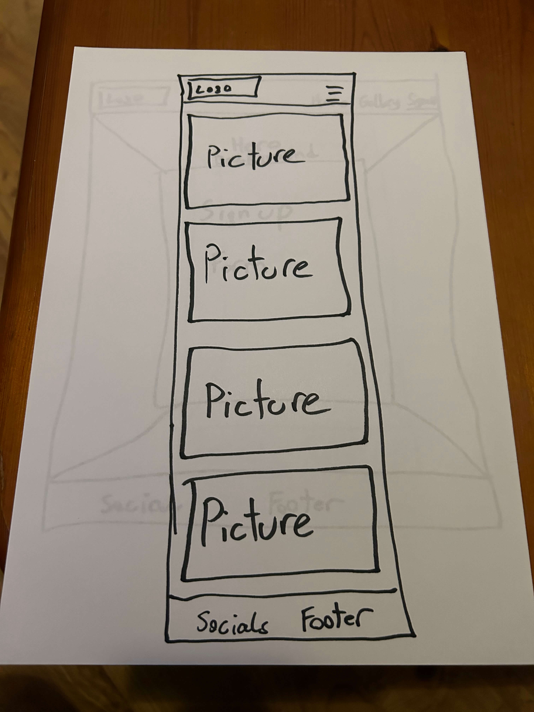
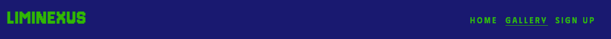
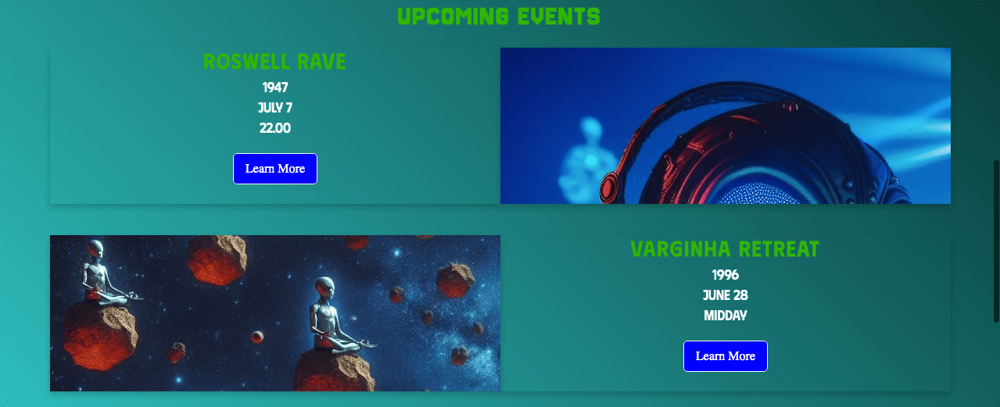
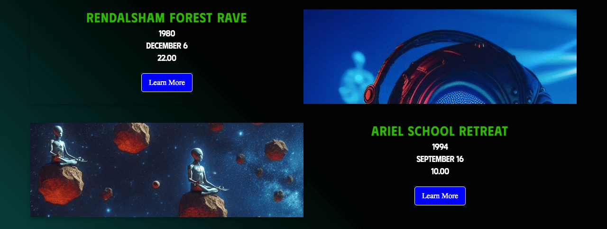
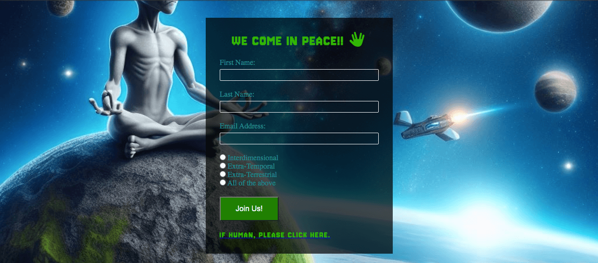

# Liminexus

Liminexus is a website that aims to advise users on the activities of the Liminexus Social Club The site is intended for interdimensional, extra-temporal and extra-terrestrial being who wish to join the Liminexus social club and take part in their activities.

Liminexus provides users with key points and reasons they may want to join the social club, upcoming events and a gallery of images from past events. Users can also make use of a sign up form to take part in past and future events. 

A Live link to the website can be found here: [Liminexus](https://dregan-dev.github.io/pp-1-tsc-/)

## Site Owner Goals 
- To provide the user with information on the activities of the Liminexus social club and reasons the may want to join.
- To present the user with a website that is easy to navigate and fully responsive.
- To provide the user with a interactive way to sign up to the social club.

## User Stories
- ### First time user
  - As a First time user, I want to easily understand the main purpose of the website and learn about all of the exciting activities the social club organises.
  - As a first time user, I was to be able to navigate the website easily and have positive emotional response to its design and usablity.

- ### Frequent User
  - As a frequent user, I want to be able to sign up to take part in past and future events.
  - As a frequent user, I want to be able to view images of events I have attended.
 
## Design

### Imagery
The imagery used on the Liminexus website is important in setting the tone of the website for the user. Images with a futuristic look were selected to give the sense of an advanced civilization or species.

### Colours
The colours used in this website were selected based on the homepage hero image. Aliens are commonly referred to as little green men and as such, green was selected as the colour for th logo and navbar items and headings on the website. Dark blue, purple and cyan were selected as complimentary colors to the shade of green selected.

### Fonts
Phudu was selected as the main font to be used throught the website due to its futuristic appearance. Jersey 10 was used for the logo and heading due to its similarities to the the vintage video game Alien Invaders. 

### Wireframes

  
Desktop Wireframe

  
  
   

  
Mobile Wireframe

  
  
  

## Features
- ### Navigation

  -The fully responsive navigation bar includes links to the Home, Gallery and Signup pages of the website.
  -The Navigation bar has a fixed position and remains at the top of the page as the user scrolls down through the various sections of each page.
  -A box shadow was used to make the header and navigation bar appear on top of the other sections of each page.
  -This feature allows the user to navigate throughout the website without having to scroll back to the top to select another page or without having to use the backwards and forward buttons on the browser.
  -This section also has an underline underneat the page the user is currently on, allowing them to feel confident in knowing where they are on the website at any given time.

- ### Landing Page

  - The Landing page includes an eye catching hero image and cover text that alludes to the time travelling nature of the social club
  - This section sets the tone of the website and gives the user a visual introduction to the other worldly nature of the sites other potential users.
  

  - As the user scrolls they are brought down to a section that details the reasons they may want to join the social club
  - At the bottom of each div there are icons that are representative of the content of each reason detailed in this section that when clicked brings the user to the gallery page.
  - The background of this section uses a linear gradient effect to represent a side profile of an illuminated flying saucer.

  - Scrolling further down the user finds an upcoming events section. Here they find 5 upcoming events that are all referencing famous ufo sighting or crash sites.
  - The background of this section uses a linear gradient effect utilzing keyframes to give the effect of a beam of light moving back and forth. This is used to represent the beam of light that could be seen emitting from a ufo while abducting a human in cartoons and movies in the past.
  - At the bottom of each event detail box there is a learn more button that when clicked takes the user to the signup page.

- ### Gallery page

  - When the user visits this page they are greeted with image of past and future events.
  - The background of this section utilises the same linear gradient effect as the events section on the landing page excepts with different colors
  - This page is fully responsive and the drid of pictures reduces from 3 per row on larger screens to 1 per row on smaller screens.

- ## Signup Page

  - Upon visiting the signup page the user is greeted by a visualy striking backgorund image of an alien meditating on a moon rock.
  - In the centre of the page their is a sign up form with a semi-transparent background. The form consists of 3 input fields for First name, Last name and email address. Below that, their are 4 radio buttons for the aliens users to specify what particular type of alien they may be.
  - Underneath the input fields their is a "join us" button that when pressed gives the user feedback as to what information has been shared with the website owner.
  - Lastly there is a line of text that reads "If Human, Please click here" and when click you may just forget what website you had just visited.

## The footer

  - This section has a very basic design with 4 evenly spaced icons for Instagram, Youtube, Facebook and Twitter(X). When these icons are clicked the open each respective social media site in a new tab so that the user does not lose theor place on the Liminexus website

### Features Left to Implement
- Articles about sightings told from the perspective on an alien species observing humans
- More interactive elements using Javascript

## Testing 

### Validator Testing
- #### Html Validator
    "Document checking completed. No errors or warnings to show."
    - [W3C Validator Home page Results](https://validator.w3.org/nu/?doc=https%3A%2F%2Fdregan-dev.github.io%2Fpp-1-tsc-%2Findex.html)
    - [W3C Validator Gallery page Results](https://validator.w3.org/nu/?doc=https%3A%2F%2Fdregan-dev.github.io%2Fpp-1-tsc-%2Fgallery.html)
    - [W3C Validator Signup page Results](https://validator.w3.org/nu/?doc=https%3A%2F%2Fdregan-dev.github.io%2Fpp-1-tsc-%2Fsignup.html)
      
- #### CSS Validator
    "Congratulations! No Error Found."
    - [CSS Validator Homepage Results](https://jigsaw.w3.org/css-validator/validator?uri=https%3A%2F%2Fdregan-dev.github.io%2Fpp-1-tsc-%2Findex.html&profile=css3svg&usermedium=all&warning=1&vextwarning=&lang=en)
    - [CSS Validator Gallery page Results](https://jigsaw.w3.org/css-validator/validator?uri=https%3A%2F%2Fdregan-dev.github.io%2Fpp-1-tsc-%2Fgallery.html&profile=css3svg&usermedium=all&warning=1&vextwarning=&lang=en)
    - [CSS Validator Signup page Results](https://jigsaw.w3.org/css-validator/validator?uri=https%3A%2F%2Fdregan-dev.github.io%2Fpp-1-tsc-%2Fsignup.html&profile=css3svg&usermedium=all&warning=1&vextwarning=&lang=en)
- #### Accessibility
    - The site received a lighthouse rating of 100% for the gallery and signup pages and 93% for the homepage. Which proves that the colors and font sizes chosen are easy to read and accessible to everyone.
 

### Form Testing
- The form has been tested to ensure it would not submit without the required input fields being filled in (first name, last name and email address).

### Links Testing
- All navigation links were tested manually to ensure the user is directed to the correct section of the website.
- Social Media links in the footer of each page were tested manually to ensure they direct the user to the correct page and open in a new tab. 

### Browser Testing
- The Website was tested on Google Chrome, Firefox, Microsoft Edge, Safari browsers with no issues noted.
    
### Device Testing
- The website was viewed on a variety of devices such as Desktop, Laptop, iPhone 13, Samsung S23 and to ensure responsiveness on various screen sizes. The website performed as intended. The responsive design was also checked using Chrome developer tools across multiple devices with structural integrity holding for the various sizes.
- I also used the following website to test responsiveness:
    - [Responsinator]((http://www.responsinator.com/?url=https%3A%2F%2Fdregan-dev.github.io%2Fpp-1-tsc-%2Findex.html))
  

### Friends and Family User Testing
Friends and family members were asked to review the site and documentation to point out any bugs and/or user experience issues.

### Known Bugs
No known bugs at this time.

## Technologies Used

### Languages
- HTML5
- CSS

### Frameworks - Libraries - Programs Used
- [Responsinator](http://www.responsinator.com/) - Used to verify responsiveness of website on different devices.
- Pen and paper wireframes
- [Chrome Dev Tools](https://developer.chrome.com/docs/devtools/) - Used for overall development and tweaking, including testing responsiveness and performance.
- [Font Awesome](https://fontawesome.com/) - Used for Social Media icons in footer.
- [GitHub](https://github.com/) - Used for version control and hosting.
- [Google Fonts](https://fonts.google.com/) - Used to import and alter fonts on the page.
- [TinyPNG](https://tinypng.com/) - Used to compress images to reduce file size without a reduction in quality.
- [W3C](https://www.w3.org/) - Used for HTML & CSS Validation.

## Deployment

The project was deployed using GitHub pages. The steps to deploy using GitHub pages are:

1. Go to the repository on GitHub.com
2. Select 'Settings' near the top of the page.
3. Select 'Pages' from the menu bar on the left of the page.
4. Under 'Source' select the 'Branch' dropdown menu and select the main branch.
5. Once selected, click the 'Save'.
6. Deployment should be confirmed by a message on a green background saying "Your site is published at" followed by the web address.

The live link can be found here - [Liminexus](https://dregan-dev.github.io/pp-1-tsc-/)

## Credits

### Content
All information on ufo crash sites was sourced from the below websites:
- [UFO's Subreddit](https://www.reddit.com/r/UFOs/)
- [Google Search](https://www.google.com)

### Media
All images and videos were sourced from the below websites with thanks to the below amazing photographers/videographers
- [Pexels](https://www.pexels.com/)
    - Anni roenkae - Hero image
- [Microsoft Copilot](https://www.bing.com/chat)
   - All Gallery images
   - Signup page background image

### Resources Used

- Inspiration for dropdown nav bar - [W3Schools](https://www.w3schools.com/)
- Inspiration for linear gradient background effect - [Codepen](https://codepen.io/P1N2O/pen/pyBNzX)
- [Stack Overflow](https://stackoverflow.com/)

## Acknowledgments
My mentor Antonio for being a pillar of support and fountain of sage advice. 

  

 
